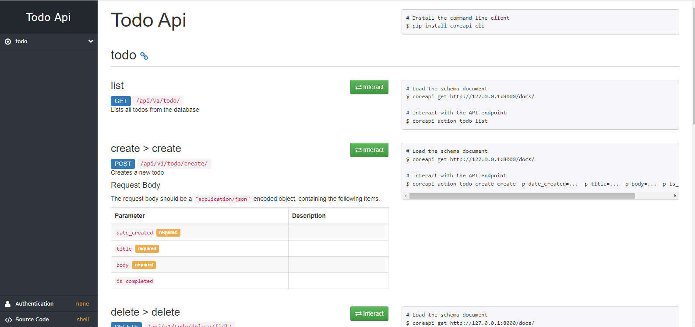
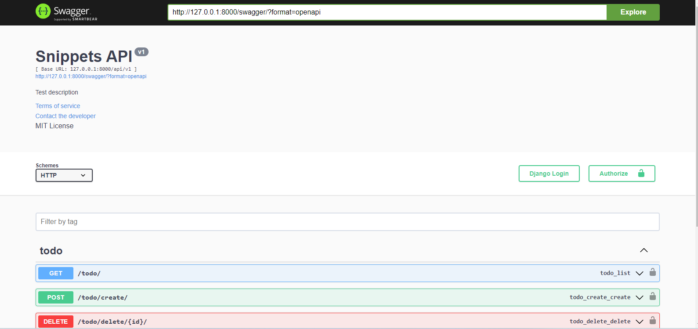
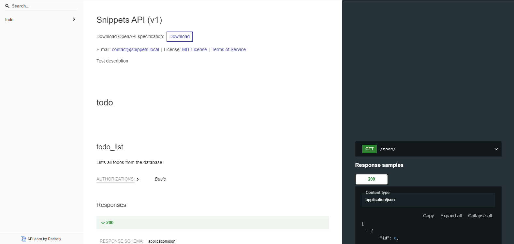

# Django API Documentation
This is a Django API Documentation project. This Repository Contains API Documentation for Django Framework. This is a simple project to learn Django Framework and REST Framework in Django. The documentation contains multiple version like Docs/Swagger/ ReDoc and much more of the features.

## Requirements
- Python 3.6+
- Virtualenv (optional)

## Installation
- Clone the repository `git clone
- Create a virtualenv with `virtualenv venv` and activate it `source venv/bin/activate`
- Install dependencies with `pip install -r requirements.txt`
- Migrate database with `python manage.py migrate`
- Run the server with `python manage.py runserver`
- Go to `http://localhost:8000` and you'll see the available list documentations.
- You can also go to `http://localhost:8000/docs` to see the Swagger Documentation.
- You can also go to `http://localhost:8000/redoc` to see the ReDoc Documentation.
- You can also go to `http://localhost:8000/swagger` to see the Swagger UI Documentation.
- You can test all the API on the Swagger/ReDoc.

## Screenshots
- Docs Version

- Swagger Version

- ReDoc Version
